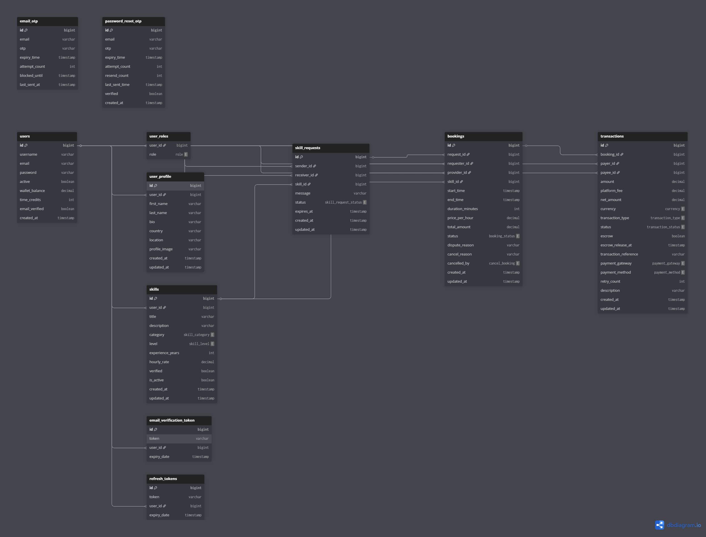
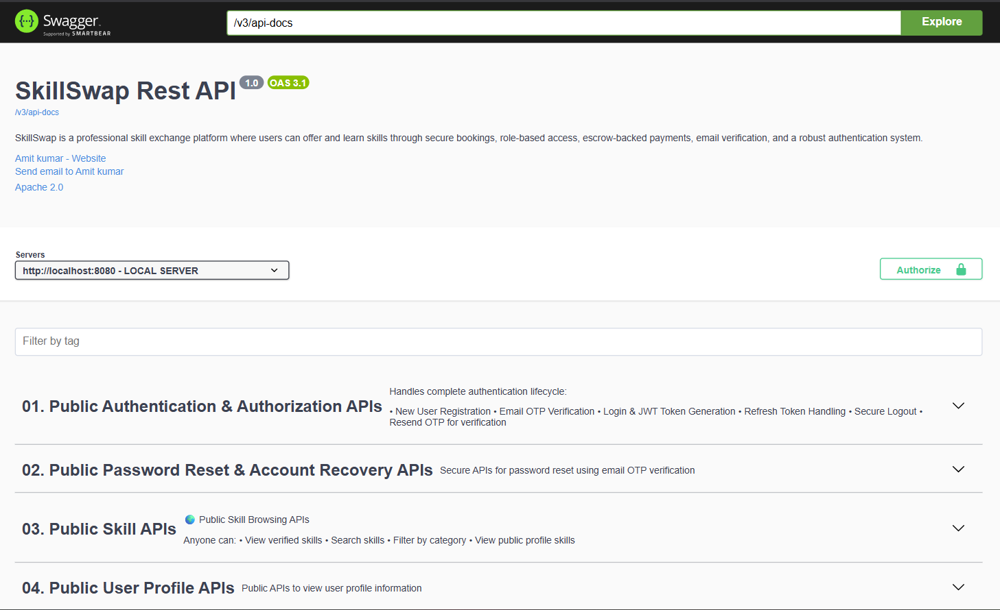
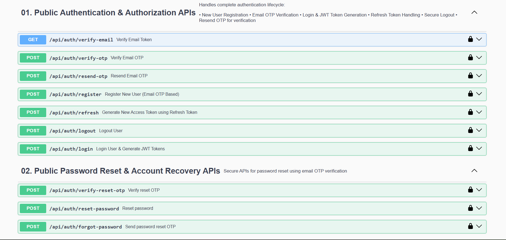
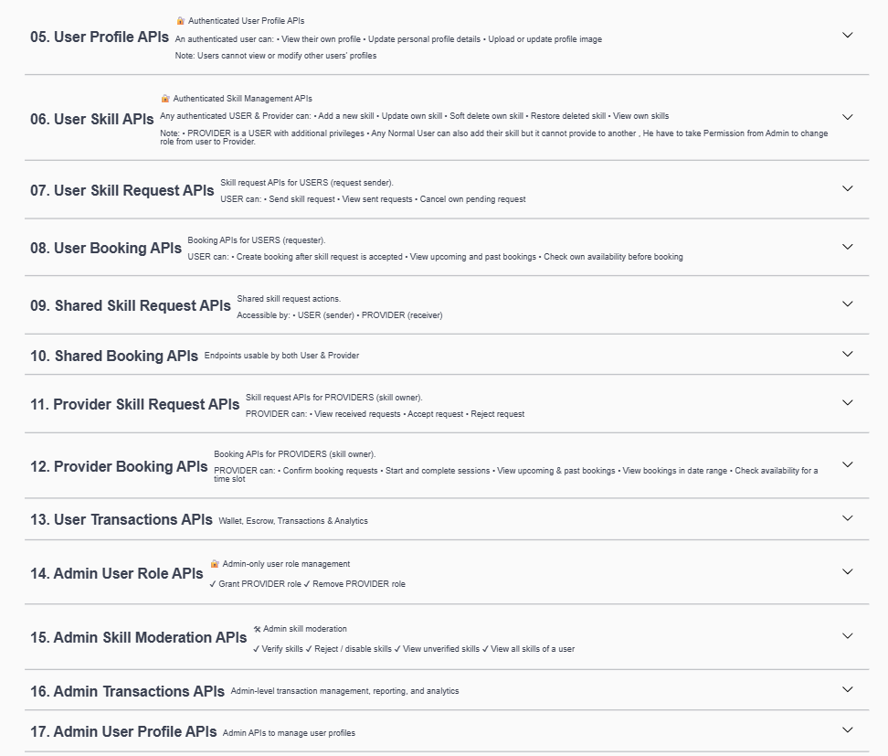

# SkillSwap – Secure Skill Exchange Platform with Wallet & Escrow Management

---

## Project Type : Backend Project (Web-based REST API System)

---

## Technology Stack
- **Backend:** Java, Spring Boot
- **Security:** Spring Security, JWT Authentication, OTP Email Verification, Role-Based Access Control (RBAC)
- **Database:** MySQL, Hibernate/JPA
- **Deployment:** Docker

- **API Testing & Documentation:** Postman, Swagger UI (OpenAPI 3)

---

## Project Overview

SkillSwap is a secure backend platform where users can offer their skills and request services from others.
The system ensures safe, transparent, and reliable payments using a wallet and escrow-based payment workflow.

You can think of SkillSwap as “Airbnb for skills”, with a strong focus on backend correctness, security, and transactional integrity.
Key highlights:
- Users can **register, login, and verify accounts via OTP**.
- **Role-based access control (ADMIN / PROVIDER / USER)** ensures secure operations.
- Users can **add skills, send requests, book services**, and make payments safely.
- Payments are first **locked in escrow** and released only when the service is completed.
- Admins can monitor transactions, bookings, and generate reports.
- System ensures **concurrency-safe operations** using optimistic locking.
- APIs are **tested with Postman, documented with Swagger**, and deployed with Docker.
---

## Problem Statement

* Users need a **trustworthy way** to pay for skills.
* Direct payments can lead to fraud if the service is not delivered.
* Platforms need **secure, concurrent, and scalable backend systems**.

### ✔ Solution

* Wallet-based payments
* Escrow system to lock funds until service completion
* Secure authentication and role-based authorization
* Transaction-safe booking lifecycle


## System Architecture

SkillSwap follows a **layered architecture**:

```
Client (Swagger / Postman)
        ↓
Controller Layer (Thin)
        ↓
Service Layer (Business Logic)
        ↓
Repository Layer (JPA / Hibernate)
        ↓
MySQL Database
```

* Controllers handle request validation
* Services contain core business rules
* Repositories handle data persistence
* Security enforced at both controller & service levels

---

## Authentication & Security

* JWT-based stateless authentication
* OTP-based email verification during registration
* Role-Based Access Control (RBAC)
* Roles supported: `USER`, `PROVIDER`, `ADMIN`
* Ownership checks for sensitive operations
* Optimistic locking for concurrency safety

---

## Core Functional Workflow (Step-by-Step)

### Step 1: User Registration & Verification

* User registers with email and password
* OTP is sent to email for verification
* After verification, user profile is created
* JWT token is issued for authenticated requests

### Step 2: Skill Management

* Users can **add, update, delete , restore skills**
* Other users can **send skill requests**
* Admin can **verify skills** before they become active / availability

### Step 3: Skill Request

* Users browse verified skills
* A skill request is sent to the provider
* Initial status: `PENDING`

### Step 4: Booking Creation

* Provider accepts the request
* Booking is created
* Booking links requester, provider, and skill

### Step 5: Wallet & Escrow Payment

* Requester pays using wallet
* Amount is locked in escrow
* Funds are not transferred immediately

### Step 6: Completion & Fund Release

* Booking marked as `COMPLETED`
* Escrow releases funds to provider
* Transaction recorded in ledger

### Step 7: Cancellation & Refund

* If booking is cancelled
* Escrow amount is refunded to requester

---

## Wallet & Escrow Flow (Visual)

```
User → Booking → Escrow Lock → Service Completed → Escrow Release → Provider
          ↘ Cancelled → Escrow Refund → User
```

* All operations are ACID-compliant
* Prevents double spending and fraud

---

## 🗂️ ER Diagram (Database Design)

The following Entity Relationship (ER) diagram represents the core database structure of the SkillSwap platform.
It illustrates entity relationships, primary keys, foreign keys, and normalization (3NF) used to ensure data
integrity, scalability, and efficient querying.



> The database is fully normalized (3NF) and designed to support secure transactional workflows,
> wallet operations, and escrow-based payments.
---

## Database Design (3NF)

The database is fully normalized (3NF) for data integrity and performance.

### Core Entities

#### 1. UserEntity

* id, username, email, roles, active, emailVerified, createdAt, updatedAt

#### 2. UserProfile

* id, userId (FK), firstName, lastName, bio, country, location, profileImage, timestamps

#### 3. UserSkill

* id, userId (FK), title, description, category, level, experienceYears, hourlyRate,
  active, verified, timestamps

#### 4. SkillRequest

* id, senderId, receiverId, skillId, message, status, expiresAt, createdAt

#### 5. Booking

* id, requesterId, providerId, skillId, startTime, endTime, durationMinutes,
  pricePerHour, totalAmount, status, cancelReason, timestamps

#### 6. Transaction

* id, bookingId, payerId, payeeId, amount, platformFee, netAmount,
  transactionType, status, escrow, escrowReleaseAt, paymentMethod,
  reference, timestamps

---

## Entity Relationships

* User 1:1 UserProfile
* User 1:N UserSkill
* User 1:N Booking (Requester)
* User 1:N Booking (Provider)
* UserSkill 1:N SkillRequest
* UserSkill 1:N Booking
* Booking 1:N Transaction
* User 1:N Transaction (payer / payee)

---

## Concurrency & Data Integrity

* Optimistic locking on transactional tables
* `@Transactional` service methods
* Prevents double withdrawal or escrow release

---
## Interface / Screens
 - Interface Used: Swagger UI

Swagger UI is used as a functional interface to visualize, test, and interact with backend APIs. While it does not replace a real frontend, it effectively demonstrates the complete backend workflow and system behavior.

---
## API Testing & Documentation

* Swagger UI for interactive API exploration
* Postman for complete workflow testing
* Edge cases tested:

    * Insufficient wallet balance
    * Duplicate requests
    * Concurrent payments

---

## 📸 Swagger UI Screenshots

Swagger UI is used as a functional interface to explore and test all backend APIs.

### 🔹 Swagger UI – API Overview


### JWT Authorization


### 🔹 Secured API Testing


---


## Dockerized Deployment

* **Docker:** Deployed backend for containerized, scalable production-ready setup
* Backend containerized using Docker
* Environment consistency ensured
* Ready for scaling and CI/CD integration

---

## Future Enhancements

* Skill-for-skill exchanges (no money)
* Payment gateway integration (Razorpay / Stripe)
* Frontend Application (React / Angular)
* Analytics dashboards
* Microservices-based scaling
* AI-based Skill Recommendation
* Notifications & Messaging

---

## 🛠️ Installation & Run Instructions

This section explains how to set up and run the **SkillSwap Backend API** locally for development and testing.

---

### 🔹 Prerequisites

Ensure the following are installed on your system:

* **Java 17+**
* **Spring Boot 3.x**
* **Maven 3.8+**
* **MySQL 8+**
* **Git**
* **Swagger / OpenAPI 3**
* **Docker** (optional, for containerized deployment)

---

### 🔹 Clone the Repository

```bash
git clone https://github.com/amitkumar-tech07/skillswap-platform-backend
cd skillswap-platform-backend
```

---

### 🔹 Database Setup (MySQL)

1. Create a database:

```sql
CREATE DATABASE skillswapDB;
```

2. Ensure MySQL is running on port `3306`.

---

### 🔹 Environment Variables Setup

Create a `.env` file in the project root directory (**do not commit this file to GitHub**):

```env
# ================= Database =================
DB_URL=jdbc:mysql://localhost:3306/skillswapDB
DB_USERNAME=root
DB_PASSWORD=your_db_password

# ================= JWT =================
JWT_SECRET=your_super_secret_jwt_key

# ================= Mail =================
MAIL_USERNAME=your_email@gmail.com
MAIL_PASSWORD=your_gmail_app_password

# ================= Server =================
SERVER_PORT=8080

# ================= CORS =================
CORS_ALLOWED_ORIGINS=http://localhost:3000,http://localhost:5173
```

Spring Boot automatically reads these variables using `${VAR_NAME}` placeholders in `application.properties`.

---
## 🧪 Test Profile & H2 Database Configuration

This project uses a **separate test profile** to ensure that automated tests do not depend on the production or development database.

### 🔹 Why Test Profile?

- Prevents accidental use of real **MySQL** data during tests
- Enables **faster and isolated** test execution
- Supports **clean CI/CD pipelines** and reliable Maven builds

### 🔹 Test Database (H2 – In-Memory)

For testing, the application uses an **H2 In-Memory Database**, which is:

- Lightweight and fast
- Auto-configured by Spring Boot
- Reset on every test run to ensure clean state

### 📌 Active Profile


###### spring.profiles.active=test
### 🔹 Run Tests
```bash
mvn test
```

### 🔹 Run the Application (Without Docker)

#### Option 1: Using Maven

```bash
mvn spring-boot:run
```

#### Option 2: Using JAR

```bash
mvn clean package
java -jar target/skillswap-backend.jar
```

---

### 🔹 Access the Application

* **Base API URL:**

```
http://localhost:8080
```

* **Swagger UI (API Interface):**

```
http://localhost:8080/swagger-ui/index.html
```

Swagger UI acts as a functional interface to:

* Register users
* Verify OTP
* Authenticate using JWT
* Test secured APIs
* Execute complete booking and escrow workflows

---

### 🔹 Run with Docker

#### Build Docker Image

```bash
docker build -t skillswap-backend .
```

#### Run Docker Container

```bash
docker run -p 8080:8080 --env-file .env skillswap-backend
```

---

### 🔹 Production Notes

* Use **Flyway / Liquibase** instead of `ddl-auto=update`
* Disable SQL debug logs
* Enable HTTPS
* Store secrets in secure vaults or cloud secret managers
* Use managed databases for production

---

### 🔹 Common Issues

| Issue                      | Solution                                            |
| -------------------------- | --------------------------------------------------- |
| Database connection failed | Verify MySQL is running and credentials are correct |
| JWT errors                 | Ensure `JWT_SECRET` is configured                   |
| OTP email not sent         | Use Gmail App Password                              |
| CORS issues                | Update `CORS_ALLOWED_ORIGINS`                       |

---

#### - The backend is now ready for API testing, frontend integration, and cloud deployment.


---

## Key Backend Concepts Demonstrated
- Transaction management & ACID compliance
- Escrow-based payment workflows
- Secure authentication & authorization
- Concurrency control with optimistic locking
- Clean layered architecture

---


## Conclusion

SkillSwap is a **real-world, production-style backend system** focusing on **security, transactions, and scalability**. It demonstrates strong backend fundamentals including authentication, authorization, database design, concurrency handling, and clean architecture.

---

## 👨‍💻 Author

**Amit Kumar**
Backend Developer | Java • Spring Boot • MySQL • JPA • Security
